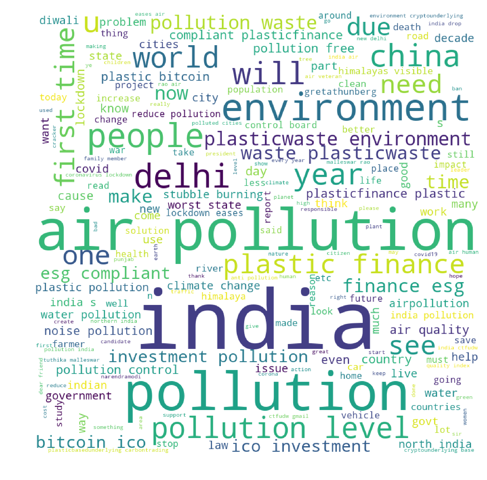

## Crawling Data

In this assignment data was scrapped from twitter using the <i>twint</i> API. Tweets related to India on the discussing about topics of Pollution, Climate Change, Eco Friendly and Flood were scrapped. 

Word cloud for data for each topic (i.e. Pollution, Climate Change, Eco Friendly and Flood) was produced. The word cloud for pollution is shown.
